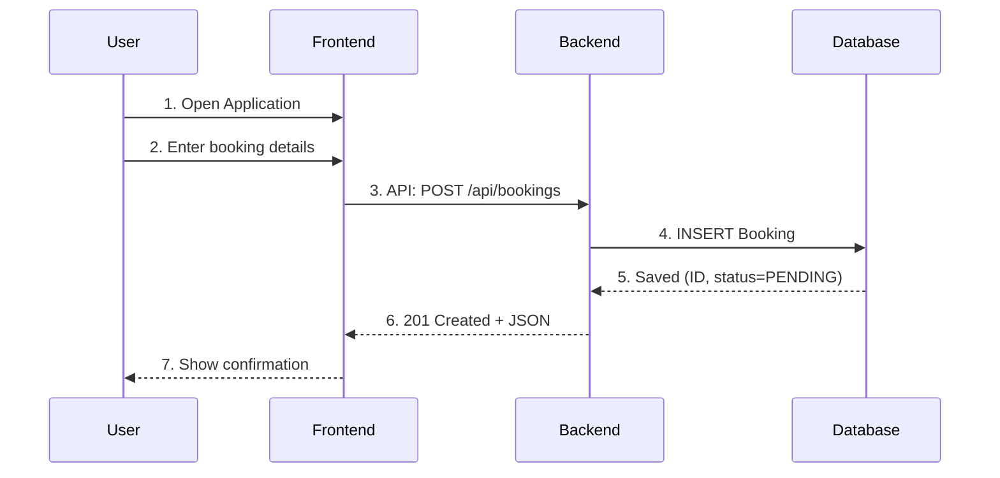

# 0. User Stories and Mockups

## Must Have
- As a tourist, I want to register/login so that I can book guides.
- As a guide, I want to register so that I can offer my services.
- As an admin, I want to approve/reject guides so that only verified guides appear.
- As a tourist, I want to browse places so that I can explore options before booking.

## Should Have
- As a tourist, I want to leave reviews so that others benefit from my feedback.

## Could Have
- As a guide, I want to upload multiple images/videos.

## Won’t Have
- Real-time chat (not in MVP).
---

# 1. System Architecture

## High-Level Components
- **Frontend**: Next.js web interface (React-based).
- **Backend**: Python + Django REST Framework (DRF).
- **Database**: MySQL relational database.

## Data Flow
Admin / Guide / Tourist → Frontend (Next.js) → Backend (Django REST API) → Database (MySQL) → Response → User

## Diagram

---

# 2. Components, Roles, and Database Design

## - Components (High-Level)

### Frontend (Next.js)
- **Pages**: `/`, `/login`, `/signup`, `/guides`, `/tours`, `/tours/[id]`, `/dashboard`
- **UI Components**: `Navbar`, `Footer`, `TourCard`, `GuideCard`, `BookingForm`, `ReviewList`, `ProfileForm`
- **State Management**: Auth state (JWT), API calls via SWR / React Query
- **Access Control**: Role-based guards (`Admin | Guide | Tourist`)

### Backend (Django + DRF)
- **Apps**: `users`, `tours`, `bookings`, `reviews`, `messaging`
- **Structure**: Models → Serializers → ViewSets → URLs
- **Security**: JWT Authentication, DRF Permissions
- **Core Services**: CRUD for tours, bookings, reviews, messaging

### Database (MySQL)
- **Schema**: Normalized relational schema for `Users`, `Guides`, `Tours`, `Bookings`, `Reviews`, `Conversations`, `Messages`
- **Constraints**: Enforced with foreign keys

---

## - Roles and Permissions

- **Admin**: Manage users, approve/disable guides, remove inappropriate content  
- **Guide**: Create/manage tours, confirm/cancel bookings, communicate with tourists  
- **Tourist**: Browse tours, create bookings, submit reviews, message guides  
- **Visitor**: Browse only  

---

## - Core Classes / Models

### `users.User`
- `id`, `email`, `password_hash`  
- `role` (ADMIN, GUIDE, TOURIST)  
- `full_name`, `phone`, `avatar_url`  
- `is_active`, `is_verified_email`  
- `created_at`, `updated_at`  

### `users.GuideProfile`
- `id`, `user_id (FK → User)`  
- `bio`, `languages`, `years_of_experience`  
- `rating_avg`, `reviews_count`  
- `location_city`, `location_country`  

### `tours.Tour`
- `id`, `guide_id (FK → GuideProfile)`  
- `title`, `description`, `category`  
- `price`, `currency`, `duration_hours`  
- `capacity`, `available_from`, `available_to`  
- `meeting_point_text`, `latitude`, `longitude`  
- `is_published`, `images (JSON)`  
- `rating_avg`, `reviews_count`  
- `created_at`, `updated_at`  

### `bookings.Booking`
- `id`, `tour_id (FK → Tour)`, `tourist_id (FK → User)`  
- `status (PENDING, CONFIRMED, CANCELLED, COMPLETED)`  
- `people_count`, `booking_date`  
- `total_amount`, `currency`  
- `notes`, `created_at`, `updated_at`  

### `reviews.Review`
- `id`, `booking_id (FK → Booking, unique)`  
- `tour_id (FK → Tour)`, `author_id (FK → User)`  
- `rating`, `comment`, `created_at`  

---

# 3. Sequence Diagram (Booking Flow)

---
# 4. API Specifications

| Method | Endpoint              | Auth   | Request Body                                                                                      | Response (201/200) Example                                                   |
|--------|-----------------------|--------|--------------------------------------------------------------------------------------------------|----------------------------------------------------------------------------|
| POST   | `/api/auth/register`  | Public | `{ "full_name": "John Doe", "email": "john@ex.com", "password": "Str0ng#Pass", "role": "GUIDE" }` | `{ "id": 1, "email": "john@ex.com", "role": "GUIDE" }`                     |
| POST   | `/api/auth/token`     | Public | `{ "email": "john@ex.com", "password": "Str0ng#Pass" }`                                          | `{ "access": "<jwt>", "refresh": "<jwt>" }`                                |
| GET    | `/api/guides`         | Public | –                                                                                                | `[ { "id": 11, "full_name": "Sara", "rating_avg": 4.8 } ]`                 |
| GET    | `/api/tours`          | Public | –                                                                                                | `[ { "id": 101, "title": "Old Riyadh Walk", "price": 150.00, "currency":"SAR"} ]` |
| GET    | `/api/tours/{id}`     | Public | –                                                                                                | `{ "id": 101, "title": "...", "description": "...", "capacity": 8 }`       |
| POST   | `/api/bookings`       | JWT    | `{ "tour_id": 101, "people_count": 2, "booking_date": "2025-10-10T09:00:00Z" }`                  | `{ "id": 9001, "status": "PENDING", "total_amount": 300.00, "currency":"SAR" }` |
| GET    | `/api/bookings/{id}`  | JWT    | –                                                                                                | `{ "id": 9001, "status": "PENDING", "people_count": 2 }`                   |
| POST   | `/api/reviews`        | JWT    | `{ "booking_id": 9001, "rating": 5, "comment": "Great tour" }`                                   | `{ "id": 501, "rating": 5, "comment": "Great tour" }`                      |
| GET    | `/api/tours/{id}/reviews` | Public | –                                                                                             | `[ { "id": 501, "rating": 5, "comment": "Great tour", "author_id": 7 } ]`  |
---

# 5. SCM and QA Strategies

## Source Control Management (SCM)
- **Repository**: GitHub
- **Branching Strategy**:
  - `main` → production-ready code
  - `dev` → integration branch for testing
  - `feature/*` → individual features or bug fixes
- **Pull Requests**:
  - Required for merging into `dev` and `main`
  - Code review mandatory
  - CI checks must pass before merge

## Quality Assurance (QA)
- **Backend Tests**:
  - Django Unit Tests (models, serializers, views, permissions)
- **Frontend Tests**:
  - Jest + React Testing Library for UI components and pages
- **Integration Tests**:
  - Postman collections / Newman CLI for API endpoints
- **Continuous Integration (CI)**:
  - GitHub Actions to run tests on every pull request
  - Coverage reports and linting (ESLint, flake8)
- **Manual QA**:
  - Staging environment for exploratory and regression testing

